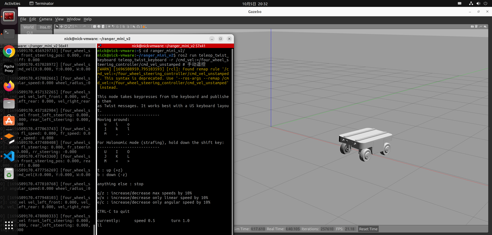

# ranger_mini_v2_gazebo

松灵舵轮底盘 ranger_mini_v2 Gazebo 仿真包

开发环境：ROS2 Humble，Gazebo 11

## 使用方式

1. 克隆仓库

    ```sh
    git clone https://github.com/LihanChen2004/ranger_mini_v2_gazebo.git
    cd ranger_mini_v2_gazebo
    ```

2. 安装依赖

    ```sh
    rosdep install -r --from-paths src --ignore-src --rosdistro $ROS_DISTRO -y
    ```

3. 编译

    ```sh
    colcon build --symlink-install
    ```

4. 启动仿真

    ```sh
    source install/setup.sh
    ros2 launch ranger_mini_v2_gazebo ranger_mini_v2_empty_world.launch.py
    ```

5. 控制机器人

    ```sh
    ros2 run teleop_twist_keyboard teleop_twist_keyboard -r /cmd_vel:=/four_wheel_steering_controller/cmd_vel_unstamped
    ```



## 当前存在一些问题：

- 机器人阿克曼形式向右前后右后转弯时，会卡住不动。
